# 基于JavaWeb技术的在线考试系统

---
### 👉作者QQ ：1556708905 微信：zheng0123Long (支持定制修改、部署调试、定制毕设)

### 👉接网站建设、小程序、H5、APP、各种系统等

---

#### 介绍

随着信息技术的不断发展和教育模式的创新，在线考试系统在教育领域的应用越来越广泛。本基于 JavaWeb 技术的在线考试系统旨在为各类教育机构和企业提供一个便捷、高效、公平、可靠的考试平台，满足其组织考试和评估学员学习成果的需求。

#### 技术栈

后端技术栈：JavaWeb+Mysql+Maven

前端技术栈：Html+Css+Javascript+ElementUI

开发工具：Idea+Vscode+Navicate

#### 系统功能介绍

（一）管理员角色  
个人中心：查看和编辑个人的基本信息，如姓名、联系方式等 ；修改个人登录密码，保障账号安全 ；查看系统操作的历史记录，包括登录时间、执行的重要操作等  
用户管理：对系统用户进行新增操作，录入用户的详细信息，如用户名、密码、所属部门或班级等 ；编辑已存在用户的信息，如修改用户的权限、所属分组等 ；对不再使用系统的用户进行删除处理，但保留相关操作记录 ；对用户进行分组管理，方便对不同类型的用户进行分类授权和管理  
考试统计管理：查看每次考试的总体情况，包括参加考试的人数、缺考人数等 ；分析考试成绩的分布情况，如优秀、良好、及格、不及格的比例 ；按照不同的维度（如班级、专业、科目等）对考试成绩进行统计和对比 ；生成详细的考试统计报表，以便进行更深入的数据分析和决策  
专业列表管理：维护系统中的专业列表，包括新增专业、修改专业名称和描述等 ；删除不再使用或错误的专业信息 ；对专业进行排序和分类，方便用户查找和选择  
专业类型管理：定义不同的专业类型，如文科类、理科类、工科类等 ；为每种专业类型设置特定的属性和规则 ；管理专业类型之间的关联和层次结构 ；根据实际需求调整专业类型的划分和定义  
考试规则管理：制定考试的基本规则，如考试时间长度、允许的答题次数等 ；设置考试的防作弊规则，如禁止切屏、禁止复制粘贴等 ；定义评分规则，如客观题自动评分、主观题人工评分的标准等 ；发布和更新考试规则，确保考生了解并遵守  
忘记密码人员登记管理：记录忘记密码的用户信息，包括用户名、联系方式等 ；处理用户的密码重置请求，确保用户能够重新登录系统 ；跟踪密码重置的处理进度和结果  
考试评分管理：对主观题进行人工评分，根据预设的评分标准给出分数 ；查看客观题的自动评分结果，进行核对和确认 ；对考试成绩进行综合计算和汇总 ；处理评分过程中的争议和问题，保证评分的公正性和准确性  
试卷管理：新建试卷，选择试卷的题型、题目数量、总分等参数 ；从试题库中选择题目添加到试卷中，支持随机抽题和手动选题两种方式 ；对已有的试卷进行编辑和修改，如调整题目顺序、更换题目等 ；删除不再使用的试卷，释放系统资源  
试题管理：新增试题，录入试题的内容、答案、所属知识点、难度等级等信息 ；对已有的试题进行修改和更新，确保试题的准确性和有效性 ；对试题进行分类和标记，方便在组卷时快速查 找和筛选 ；删除过时或错误的试题  
系统管理：进行系统的参数设置，如服务器配置、数据备份策略等 ；管理系统的用户角色和权限，确保不同用户具有适当的操作权限 ；监控系统的运行状态，及时处理系统故障和异常情况 ；对系统进行升级和维护，保障系统的稳定性和安全性  
考试管理：安排考试时间、地点、考试科目等详细信息 ；发布考试通知，告知考生考试的相关要求和注意事项 ；监控考试过程，处理突发情况，如考生的违规行为等 ；结束考试并进行相关的后续处理，如成绩公布、试卷归档等    
（二）用户角色  
考试规则：查看考试的具体规则，包括考试时间、答题要求、评分标准等 ；了解考试的防作弊措施和违规处理办法 ；确认自己已经清楚并愿意遵守考试规则  
试卷列表：查看当前可参加的考试试卷列表，包括试卷名称、考试科目、考试时间等信息 ；了解试卷的题型和题量分布 ；选择相应的试卷进行考试  
考试资讯：获取最新的考试安排和通知，包括考试时间的变更、新增考试等信息 ；阅读与考试相关的政策和规定的更新 ；了解考试成绩的发布时间和查询方式  
个人中心：查看个人的基本信息，如姓名、学号或工号等 ；修改个人的联系方式等信息 ；查看自己的考试历史记录，包括已参加的考试、考试成绩等  
后台管理：考试评分管理：协助管理员对部分主观题进行评分

#### 系统作用

提高考试效率：在线考试系统实现了考试的自动化和信息化，大大减少了传统考试中繁琐的组织和准备工作，如试卷印刷、考场安排、监考人员调配等 ；考生可以随时随地参加考试，不受时间和空间的限制，提高了考试的灵活性和便捷性 ；系统能够自动判卷和统计成绩，大大缩短了考试结果的反馈时间，提高了考试的效率和管理水平  
保证考试公平：严格的考试规则和防作弊措施，如限制切屏、禁止复制粘贴等，有效地减少了考试作弊的可能性，保证了考试的公平性和公正性 ；随机抽题和打乱题目顺序的功能，使得每个考生的试卷都不同，降低了抄袭的风险 ；统一的评分标准和客观的自动评分机制，避免了人为因素对评分的影响，确保了考试结果的准确性和可靠性  
优化教学评估：丰富的考试统计功能，能够为教师和教育管理者提供详细的考试数据和分析报告，帮助他们了解学生的学习情况和教学效果 ；通过对考试成绩的分析，教师可以发现教学中的薄弱环节和学生的知识漏洞，从而有针对性地调整教学策略和教学内容，提高教学质量 ；系统可以长期保存考试数据，为教学评估和教育研究提供了宝贵的资料  
节约资源成本：在线考试无需使用纸张和印刷设备，减少了资源的消耗和浪费，符合环保理念 ；减少了人工监考和阅卷的人力成本，降低了考试组织的费用 ；系统的自动化管理降低了考试管理的错误率和重复劳动，提高了资源的利用效率  
提升用户体验：简洁明了的界面设计和操作流程，方便考生和管理员快速上手使用 ；及时的系统通知和反馈机制，让考生和管理员能够随时了解考试相关的信息和处理结果 ；系统的稳定性和可靠性，保障了考试过程的顺利进行，为用户提供了良好的使用体验  

#### 系统功能截图

代码结构

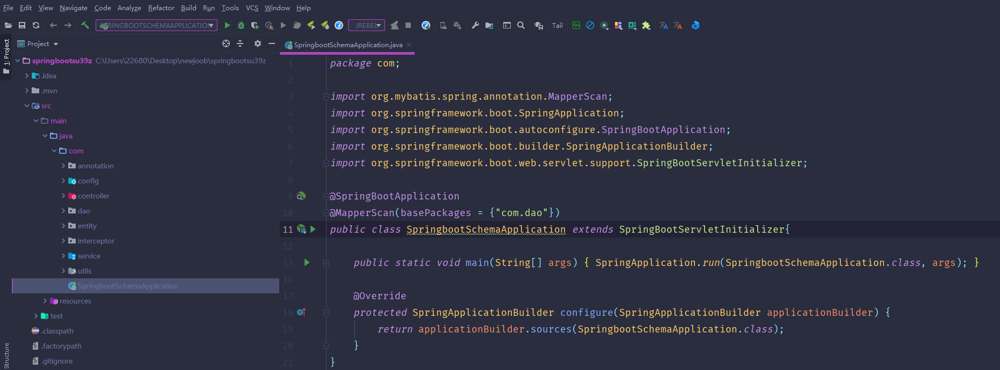

数据库表

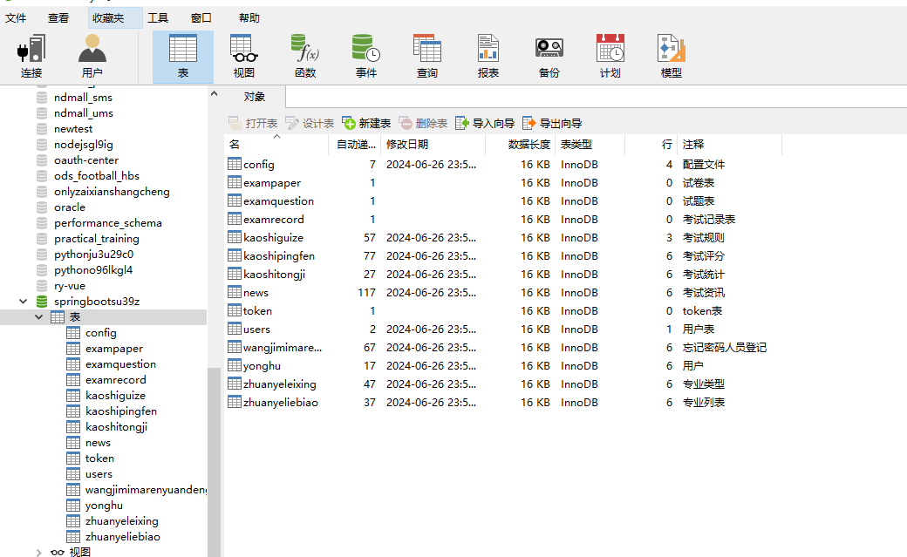

登录

首页

试卷列表

考试资讯

个人中心

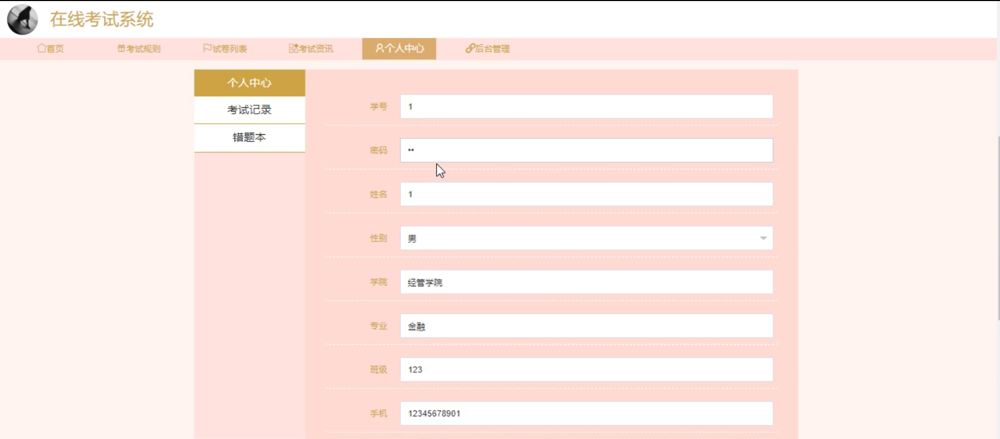

用户端后台管理

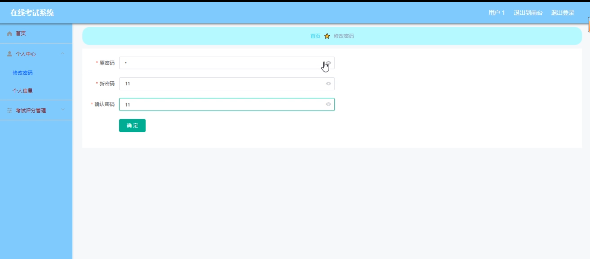

管理端用户管理

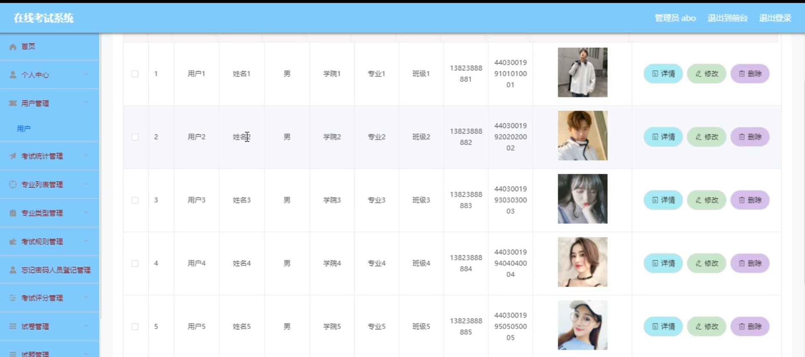

考试统计管理

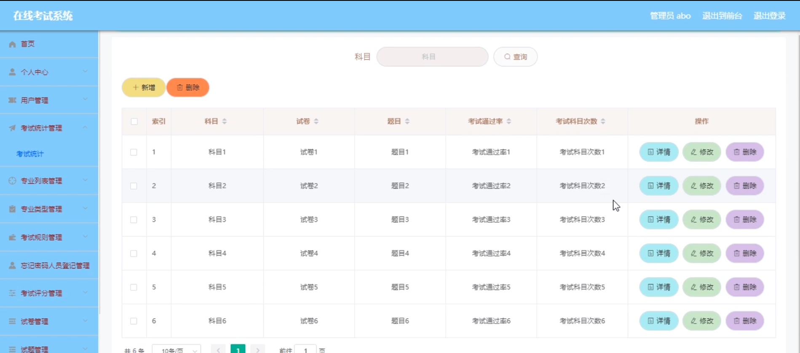

专业列表管理

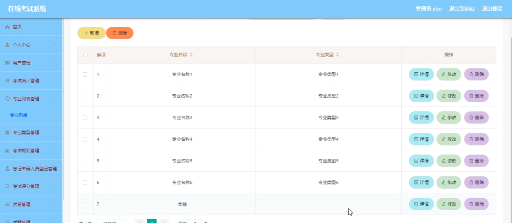

忘记密码人员登记管理

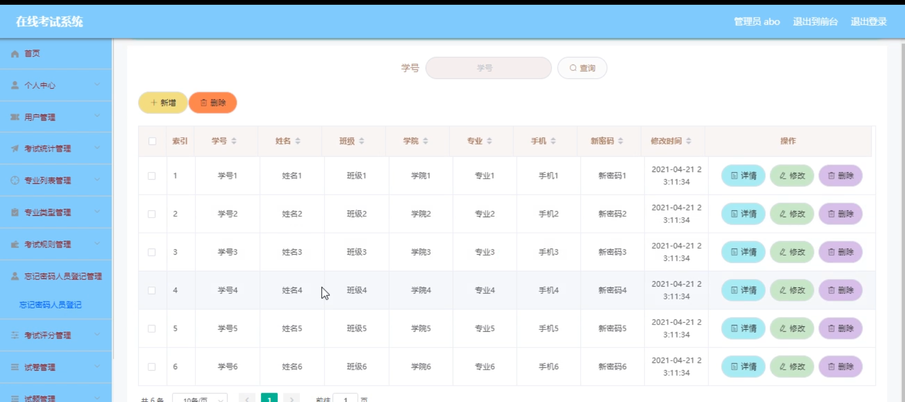

考试评分管理

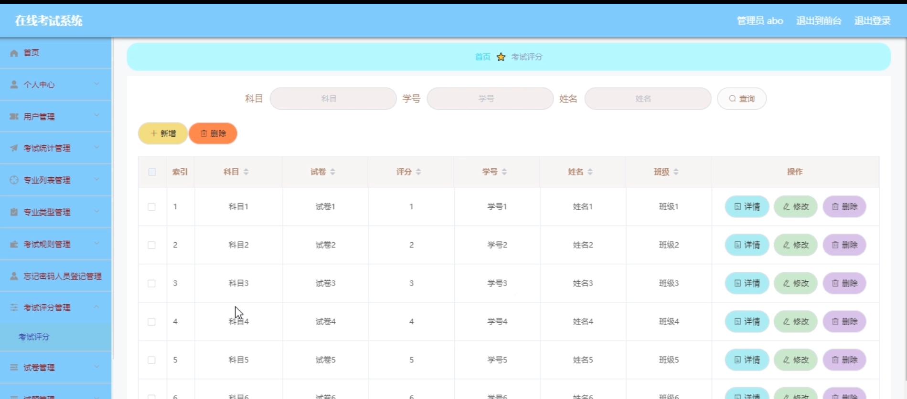

试卷管理

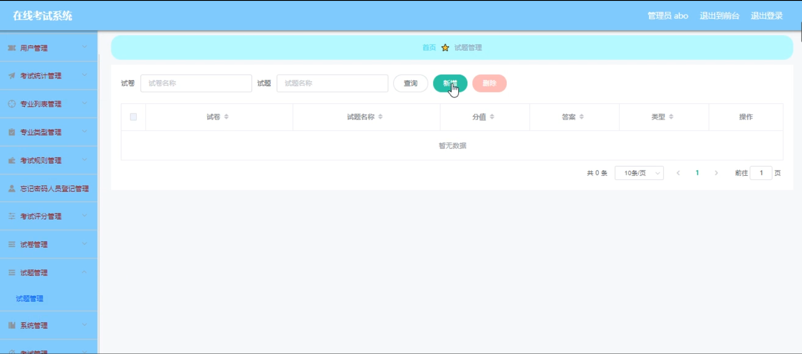

试题管理

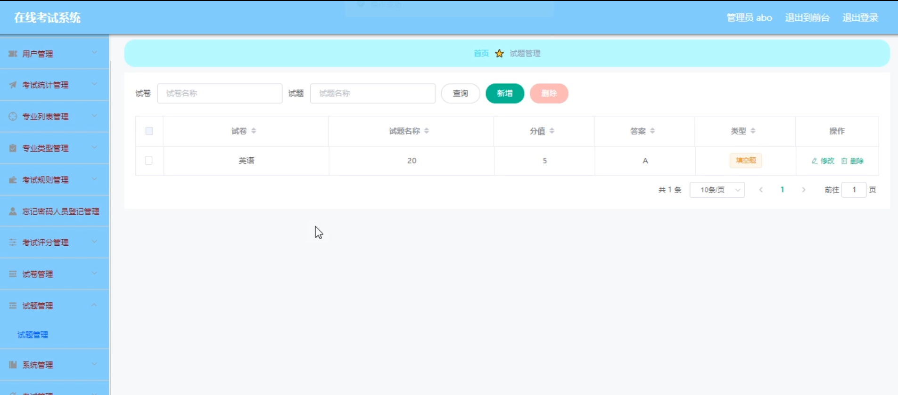

#### 总结

本基于 JavaWeb 技术的在线考试系统，通过科学合理的功能设计和完善的管理机制，为教育机构和企业提供了一个高效、公平、便捷的考试解决方案。无论是管理员还是用户，都能在系统中享受到便捷的服务和高效的操作体验。该系统不仅提高了考试管理的效率和质量，还为教学评估和教学改进提供了有力的支持，有助于推动教育信息化的发展和创新。

#### 使用说明

创建数据库，执行数据库脚本 修改jdbc数据库连接参数 下载安装maven依赖jar 启动idea中的springboot项目

后台地址：http://localhost:8080/springbootsu39z/admin/dist/index.html

管理员  abo 密码 abo

前台地址：http://localhost:8080/springbootsu39z/front/index.html